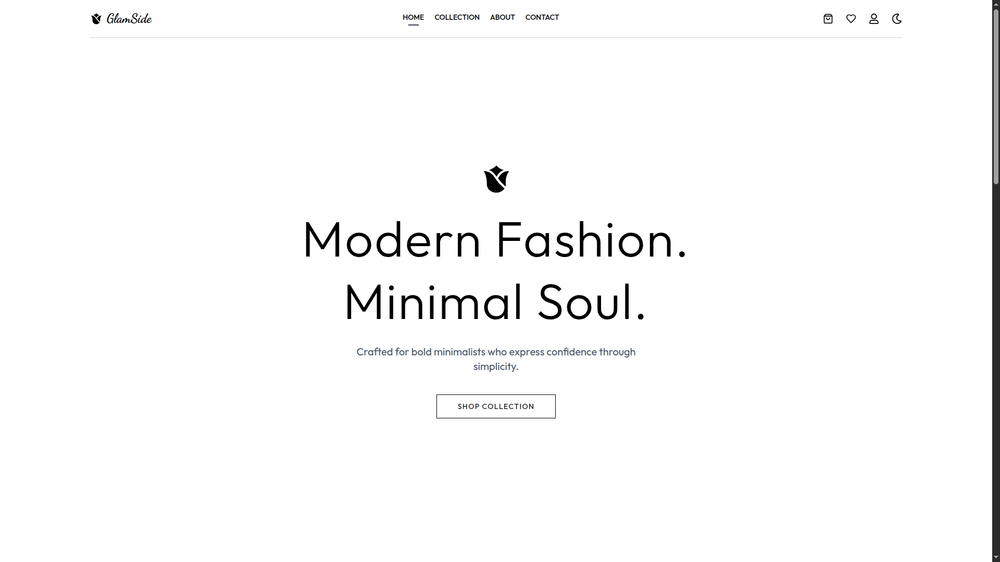
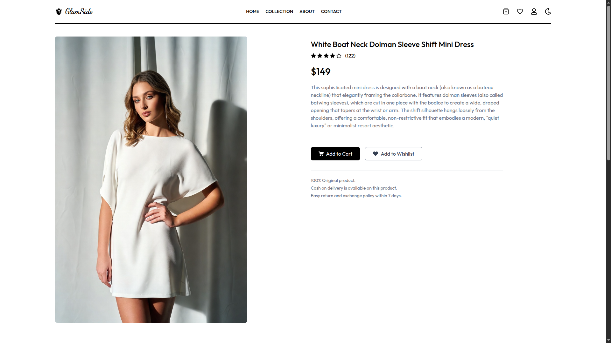
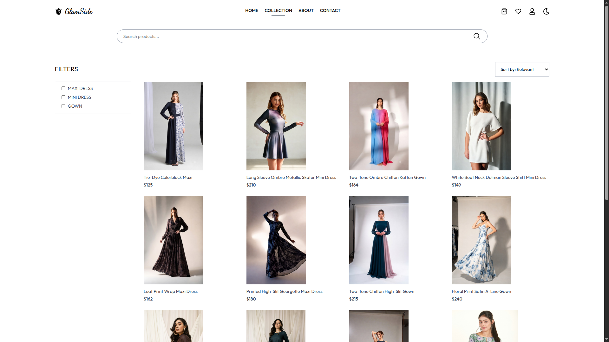
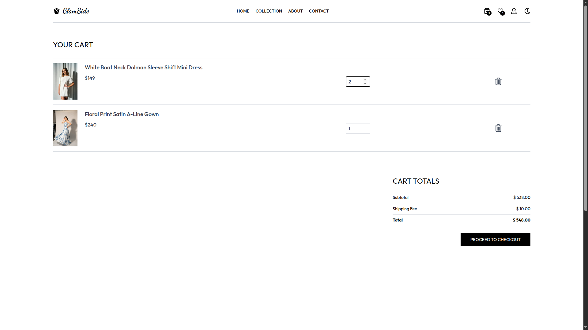
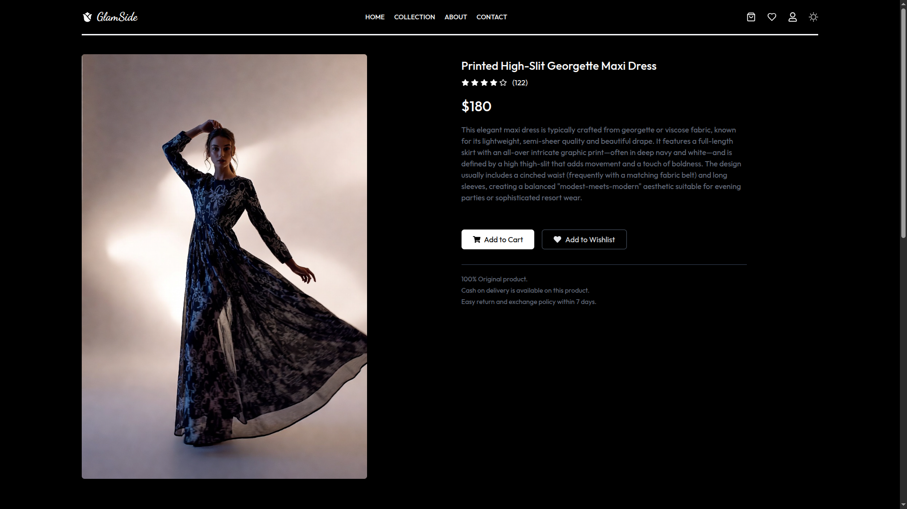
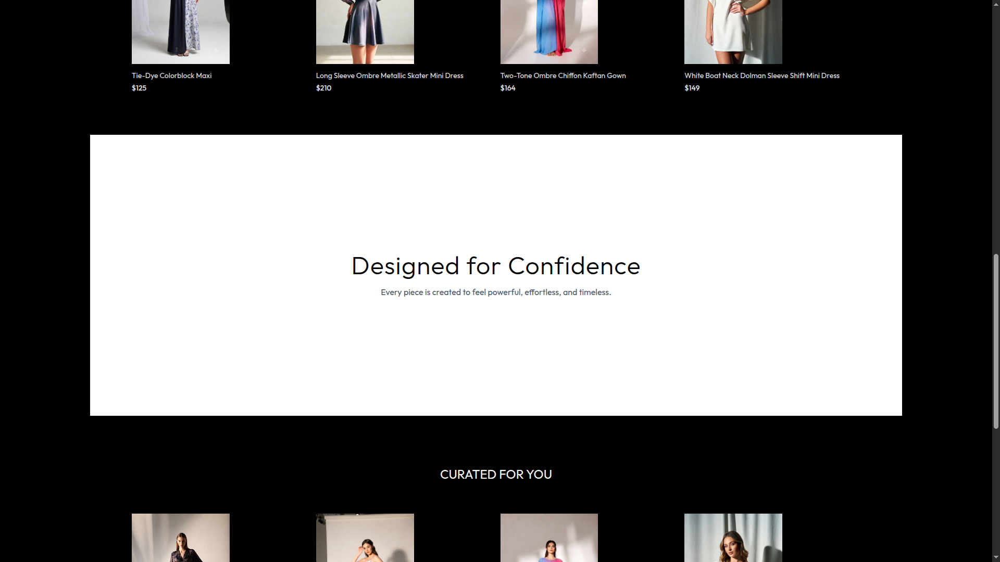
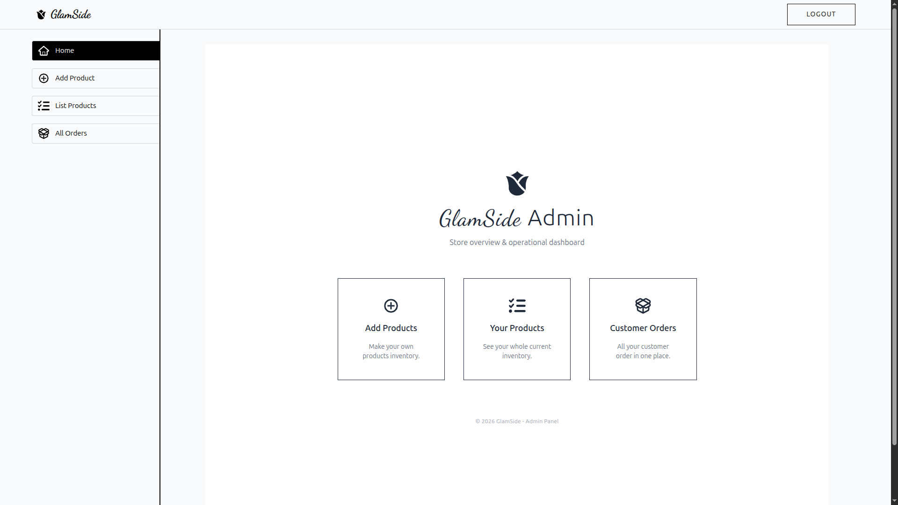
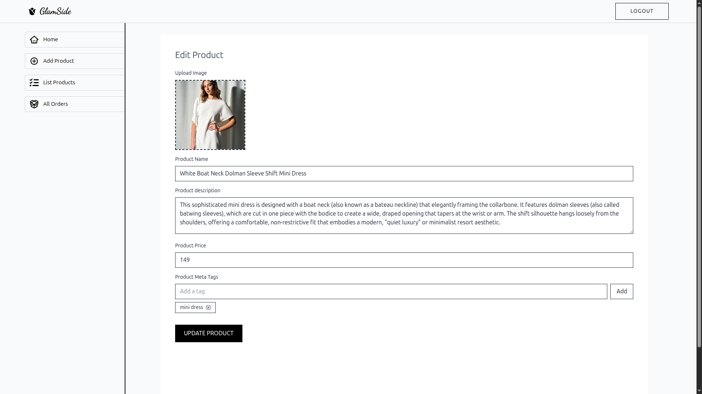
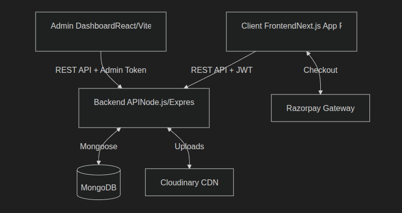

# Glamside: A Modern E-Commerce Platform

Glamside is a comprehensive e-commerce platform that features a user-friendly interface for browsing and purchasing products, as well as a dedicated admin panel for managing inventory and orders.

> **[Live Demo](https://glamside.vercel.app)** (deployed using Vercel, MongoDB Atlas and Cloudinary)

## Key Features

### Client Storefront
* **SEO-Optimized Rendering:** Built with Next.js (App Router), leveraging Server-Side Rendering (SSR) for the product catalog to ensure maximum visibility for search engine crawlers.
* **Shopping Cart & Wishlist:** Real-time state management using React Context API.
* **Seamless Checkout:** Natively integrated **Razorpay** payment gateway for secure, frictionless transactions.
* **Responsive & Accessible Design:** Fully styled using Tailwind CSS v4, featuring a dynamic dark mode and fluid typography.

### Admin Dashboard
* **Inventory Management:** A secure Vite-based React SPA for administrators to add, edit, and remove products.
* **Image Hosting CDN:** Direct integration with **Cloudinary** for scalable, optimized product image hosting via `multer`.
* **Order Fulfillment:** Real-time dashboard to track customer purchases and update shipping statuses dynamically.

### Backend (Node.js)
* **RESTful API Architecture:** Serves as the central hub handling complex business logic, database transactions, and seamless integration with the Razorpay SDK.
* **Secure Authentication:** Utilizes JWT (JSON Web Tokens) and `bcrypt` password hashing, featuring custom `adminAuth` middleware for role-based access control.
* **Robust Data Management:** Built on top of MongoDB (with Mongoose) to reliably store and manage user profiles, product catalogs, and order histories.
* **Media Handling:** Employs `multer` to securely process incoming form-data and pipe image uploads directly to Cloudinary.

## Screenshots

<p align="center">
  
  &nbsp; &nbsp;
  
</p>
<p align="center">
  <em>Left: Home Page. Right: Product Page.</em>
</p>

<p align="center">
  
  &nbsp; &nbsp;
  
</p>
<p align="center">
  <em>Left: Collection Page. Right: Cart Page.</em>
</p>

<p align="center">
  
  &nbsp; &nbsp;
  
</p>
<p align="center">
  <em>Left: Dark Mode Product Page. Right: Dark Mode Home Page Section.</em>
</p>


<p align="center">
  
  &nbsp; &nbsp;
  
</p>
<p align="center">
  <em>Left: Admin Dashboard. Right: Admin Add/Edit Product.</em>
</p>


## Architecture

The project is built on a modern **MERN-variant stack**, utilizing Next.js for the client-facing storefront to maximize SEO, a React SPA for the admin dashboard, and a Node.js/Express backend communicating with MongoDB.




1. `/backend` - The central REST API handling business logic, database transactions, and authentication.
2. `/frontend` - The SEO-driven Next.js client application.
3. `/admin` - The internal dashboard for store managers.

## Tech Stack

- **Frontend:** Next.js 15 (App Router), React 19, Tailwind CSS v4
- **Backend:** Node.js, Express.js
- **Database:** MongoDB (via Mongoose)
- **Authentication:** JWT (JSON Web Tokens), bcrypt
- **Payments:** Razorpay
- **Image Storage:** Cloudinary

## Installation & Setup

### Prerequisites
* Node.js (v18+)
* MongoDB instance (local or Atlas)
* Cloudinary API keys
* Razorpay API keys

### 1. Backend Setup
```bash
cd backend
npm install
```
Create a `.env` file in the `backend` directory:
```env
MONGODB_URI=your_mongodb_connection_string
JWT_SECRET=your_jwt_secret
CLOUDINARY_NAME=your_cloudinary_name
CLOUDINARY_API_KEY=your_cloudinary_api_key
CLOUDINARY_SECRET_KEY=your_cloudinary_secret_key
RAZORPAY_KEY_ID=your_razorpay_key
RAZORPAY_KEY_SECRET=your_razorpay_secret
ADMIN_EMAIL=admin@admin.com
ADMIN_PASSWORD=admin123
```
Start the backend server:
```bash
npm start
```

### 2. Frontend Setup
```bash
cd frontend
npm install
```
Create a `.env` file in the `frontend` directory:
```env
NEXT_PUBLIC_BACKEND_URL=http://localhost:4000
NEXT_PUBLIC_RAZORPAY_KEY_ID=your_razorpay_key
```
Start the frontend development server:
```bash
npm run dev
```

### 3. Admin Setup
```bash
cd admin
npm install
```
Create a `.env` file in the `admin` directory:
```env
VITE_BACKEND_URL=http://localhost:4000
```
Start the admin development server:
```bash
npm run dev
```

## Future Roadmap
- [ ] OAuth Authentication to integrate Social Logins
- [ ] Product Reviews & Ratings
- [ ] Integrate SendGrid for Email notifications and confirmations
- [ ] Analytics Dashboard with interactive charts 


## License
This project is open-source and available under the MIT License.

## Author

Hello, I am **Shubham Ramdeo**. Nice to meet you!

If you like my work, let's connect on [Linkedin](https://linkedin.com/in/ramdeoshubham) | [GitHub Profile](https://github.com/ramdeoshubham) | [Personal Website](https://github.com/ramdeoshubham) 
